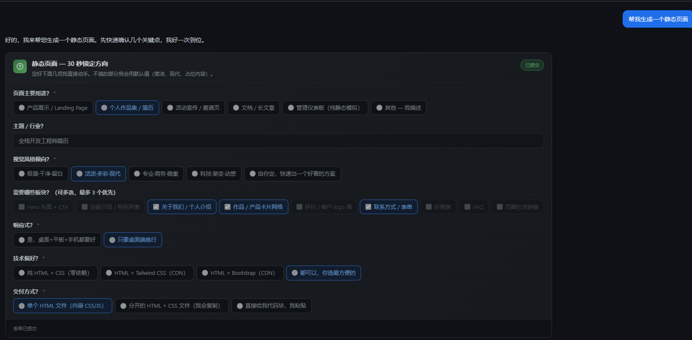

# Agent Question Form

[](./LICENSE)
[](https://nodejs.org)
[](https://www.typescriptlang.org/)
[](https://react.dev/)
[](https://vitejs.dev/)
[](https://mastra.ai)
[](https://deepseek.com)

[中文文档](./README.md)

## Overview

An AI design assistant built on the **Mastra** framework. Its core innovation is **Question-Form** — when a user submits a design brief, the Agent analyzes the request and dynamically generates a structured, interactive question card. Users clarify requirements through simple clicks and selections, enabling high-quality output with minimal communication overhead.

<p align="center">
  
</p>

> **Core Philosophy**: On the first turn, the Agent doesn't rush to write code. Instead, it emits a smart card to lock down requirement variables. Users pick options instead of typing — 30 seconds to align on requirements, then TodoWrite planning → design generation → 5-dimension self-critique.

## Tech Stack

| Layer           | Technology                                                              |
| --------------- | ----------------------------------------------------------------------- |
| Agent Framework | [Mastra](https://mastra.ai)                                             |
| LLM             | DeepSeek V4 Pro                                                         |
| Backend         | Express + SSE streaming                                                 |
| Frontend        | React 19 + TypeScript + Vite 6 + Tailwind CSS 4                         |
| Storage         | LibSQL (conversation memory) + DuckDB (observability)                   |
| Evaluation      | Mastra Evals (tool-call accuracy / completeness / discovery compliance) |

## Core Features

### Smart Question-Form Cards

- Agent analyzes user input and **dynamically generates tailored forms** with radio, checkbox, select, text, and textarea question types
- Users clarify requirements through **clicking + brief input**, drastically reducing communication friction
- Form answers are auto-formatted into `[form answers]` blocks recognized by the Agent for seamless follow-up
- Historical forms remain in **submitted/read-only** state for easy review

### Streaming Chat Experience

- Real-time streaming via **SSE (Server-Sent Events)**, with token-by-token rendering
- DeepSeek **reasoning (thinking) content** displayed in real time
- `<question-form>` tags detected mid-stream and immediately swapped for interactive form cards
- `<function_calls>` blocks parsed into live **TodoWrite progress cards**

### Multi-Step Design Workflow

Parse Brief → Generate Artifact → 5-Dim Critique

- **Parse**: Extract design requirements to structured JSON
- **Generate**: Produce a complete HTML design artifact
- **Critique**: Score across 5 dimensions (philosophy / hierarchy / execution / specificity / restraint)

### Conversation History

- Persistent memory via Mastra Memory + LibSQL
- Sidebar with thread history, switching, and replay
- Auto-titled threads sorted by recency

## Quick Start

### Prerequisites

- Node.js >= 22.13.0
- DeepSeek API Key (or any OpenAI-compatible API)

### Install & Run

```bash
# 1. Clone
git clone https://github.com/MetaBrain-Labs/agent-question-form.git
cd agent-question-form

# 2. Configure environment
cp .env.example .env
# Edit .env with your DEEPSEEK_API_KEY

# 3. Install dependencies
npm install
cd client && npm install && cd ..

# 4. Start backend (localhost:3000)
npm run chat

# 5. Start frontend (localhost:5173, new terminal)
npm run dev:client

# Or run both at once
npm run dev:all
```

Open http://localhost:5173 to start chatting.

## Project Structure

```
├── src/
│   ├── mastra/                    # Mastra configuration hub
│   │   ├── agents/                # Agent definitions (question-form-agent)
│   │   ├── workflows/             # Workflows (parse → generate → critique)
│   │   ├── prompts/               # System prompts (discovery-first dialogue strategy)
│   │   ├── scorers/               # Evaluators (tool-call / completeness / compliance)
│   │   └── utils/                 # Form parser utilities
│   ├── chat-server.ts             # Express backend (SSE API + streaming parser)
│   └── utils/                     # Stream event types & conversion
├── client/                        # React frontend
│   └── src/
│       ├── components/            # UI components
│       │   ├── QuestionForm.tsx   # Question-Form card core component
│       │   ├── ChatApp.tsx        # Main chat interface
│       │   ├── MessageBubble.tsx  # Message bubble (inline form rendering)
│       │   ├── TodoCard.tsx       # TodoWrite progress card
│       │   ├── Sidebar.tsx        # History sidebar
│       │   └── ProseBlock.tsx     # Markdown rendering (copy code)
│       ├── hooks/                 # useChat (SSE streaming hook)
│       └── utils/                 # Markdown rendering, Question-Form parser
└── package.json
```

## API

| Endpoint                    | Method | Description                                        |
| --------------------------- | ------ | -------------------------------------------------- |
| `/api/chat`                 | POST   | SSE streaming chat, body: `{ message, threadId? }` |
| `/api/threads`              | GET    | List historical threads                            |
| `/api/threads/:id/messages` | GET    | Retrieve messages for a thread                     |
| `/api/health`               | GET    | Health check                                       |

## Stream Event Types

| Event                        | Description                              |
| ---------------------------- | ---------------------------------------- |
| `start`                      | Stream begins                            |
| `thinking` / `thinking-done` | DeepSeek reasoning content               |
| `text`                       | Plain text output                        |
| `question-form-start`        | Question-form opening tag detected       |
| `question-form-complete`     | Question-form fully received (with JSON) |
| `todo-update`                | TodoWrite progress update                |
| `tool-call` / `tool-result`  | Mastra tool invocations                  |
| `finish`                     | Stream complete (with token usage)       |
| `error`                      | Stream error                             |

## License

[MIT](./LICENSE) © 2026 MetaBrain-Labs
